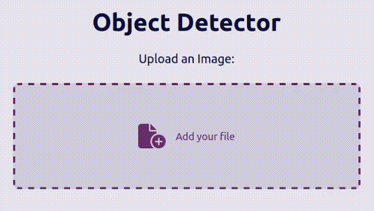
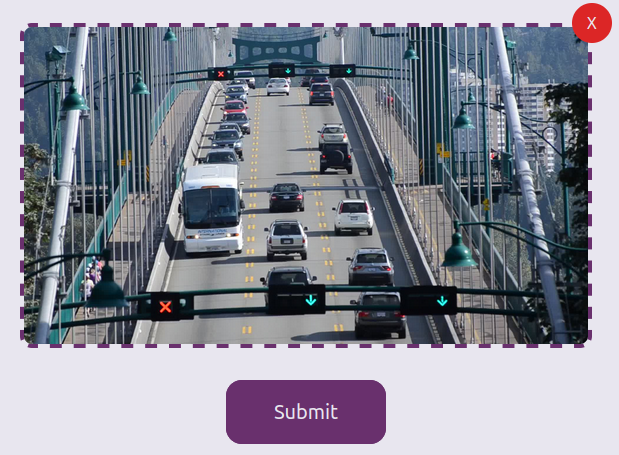
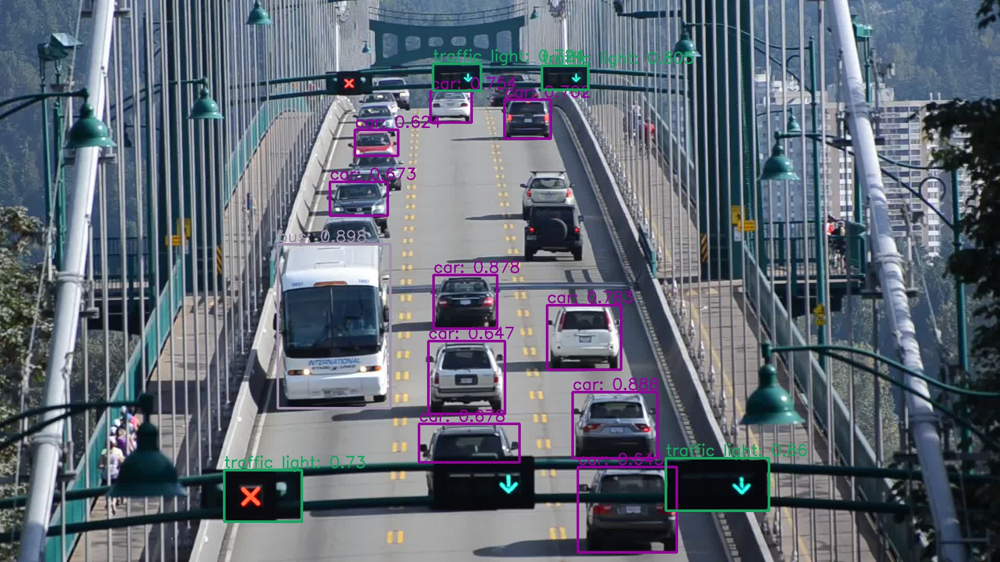

# Object Detection Online!

Check out the demo [here](https://projects.object-detector.luiz.lat/)!

This project is a client for the API I made to detect objects in images. You can look at the API code [here]((https://github.com/Luisill0/object-detector-api)) 😊

## How to use

Select your image

Click submit

Wait for a couple seconds, my server is slow

Look at your cool image with annotations!
